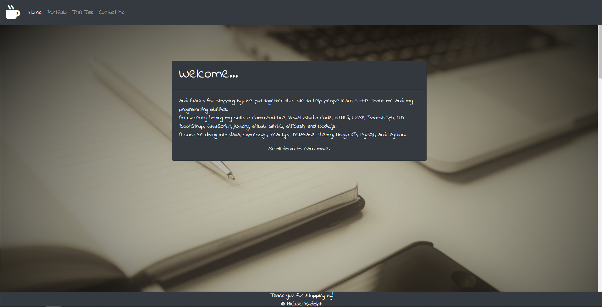
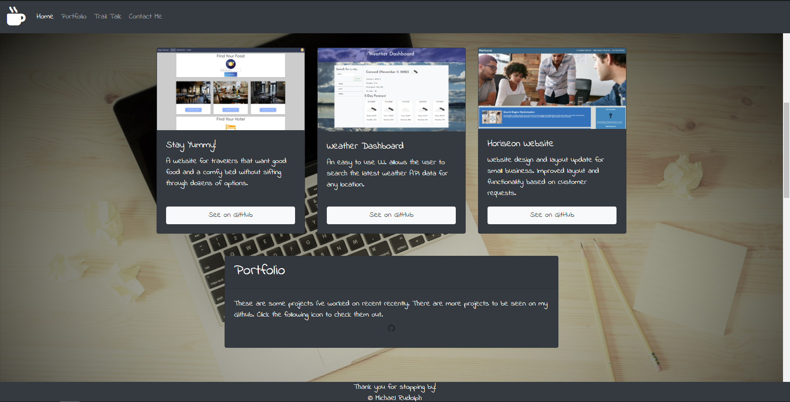
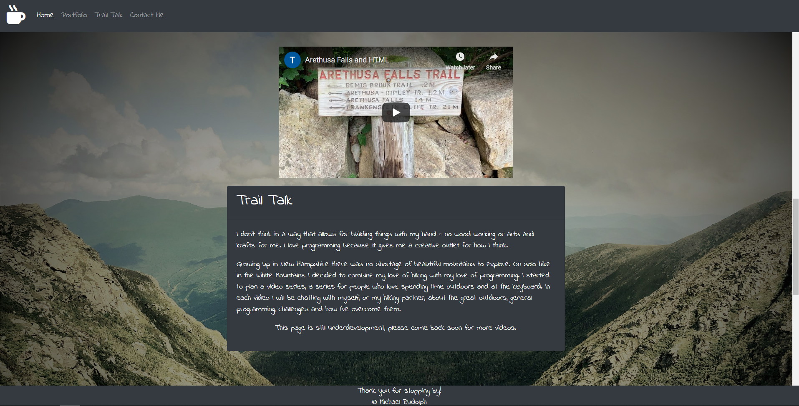
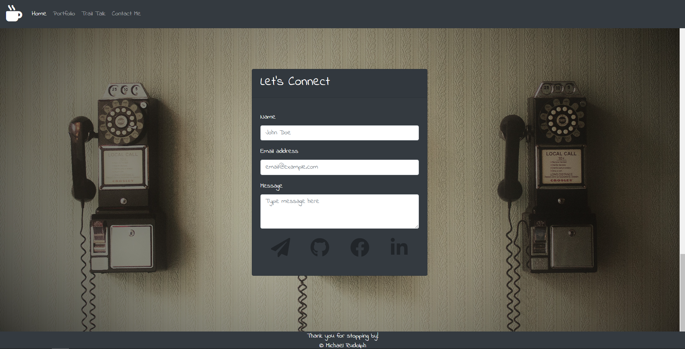
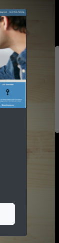

# Week 8: Portfolio Update

Portfolio now includes icons, parallax background, programming languages, minimalist color scheme and layout.
Designed for 24" monitors, further update will add responsive functionalities.

Deployed website link -> https://github.com/ReindeerCode/Portfolio-Website.git
Used the following site for verification -> https://validator.w3.org/nu/

Following screen shot is of the Home section

Following screen shot is of the Portfolio section

Following screen shot is of Trail Talk section

The following screen shot is of the Contact section

The following screen shot is of the dark theme scroll bar

